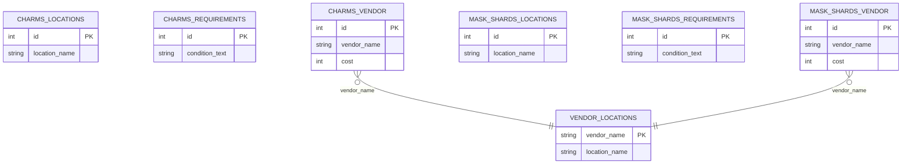

# Project Plan

by Logan DeNezza (denezza.4)

## Intro

Hollow Knight - Charms, Notches, Upgrades, Shops, and more

Hollow Knight is an indie videogame developed by Team Cherry in 2017. It sold
15 million copies, making it one of the most successful indie games of all time.

This project will map transactions between useful game items, such as charms,
notches, mask shards, and spells. These interact with multiple locations,
sublocations, shops, vendors, side-quests and more.

## ER Schema

See models/ER-model.png.

## DB Schema

## DBMS

I will use SQLite, as it is a free DBMS.

## Programming Language

I will be using Rust as my programming language of choice.